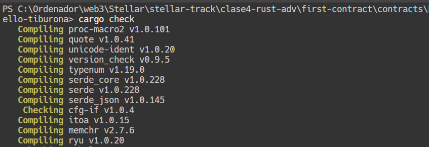
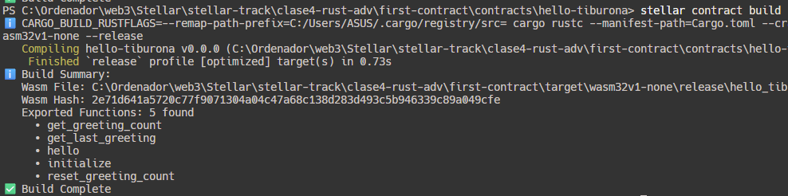
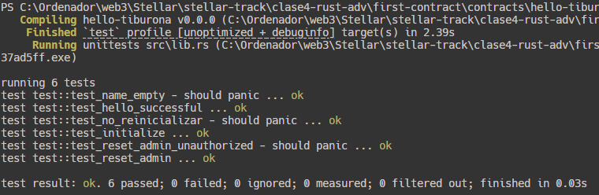
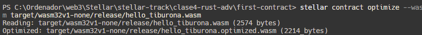
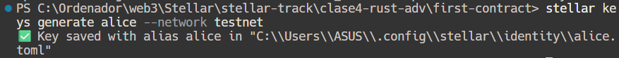
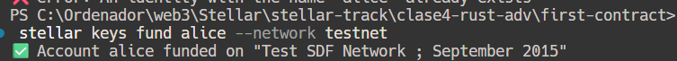
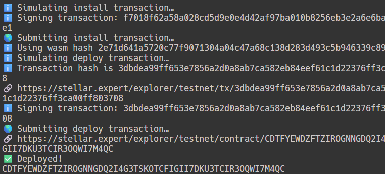
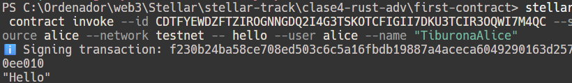
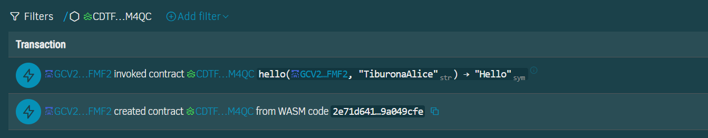

# Primer Contrato: Hello Tiburona 🦈💗

## Resumen
Este doc describe el proceso completo de creacion, compilacion y despliegue de un contrato inteligente en Soroban.

## Herramientas Necesarias
- **Stellar CLI**: v23.0.1
- **Rust**: Con target `wasm32v1-none`
- **WSL**: Windows Subsystem for Linux
- **VS Code**: Editor recomendado

## Estructura del Proyecto

```bash
hello-tiburona/
└── src/
|    └── lib.rs
|    └── test.rs
├── Cargo.toml // Archivo de configuración de Rust
|-- Makefile
|-- README.md //Este documento
|-- test_snapshots/
```
# Desarrollo Paso a Paso
## Antes de Comenzar
Asegúrate de tener instalado Stellar CLI y Rust con el target `wasm32v1-none`.
### 1. Verificar la instalacion de Stellar CLI
```bash
stellar --version
```

### 2. Crear el Proyecto
```bash
stellar contract init first-contract
```
### 3. Revisar la estructura
```bash
ls contracts/hello-tiburona/src
```

### 4. Abrir en VS Code
```bash
code .
```

## Compilacion y Deploy
### 5. Verificar que compila
```bash
cargo check
```
### 6. Compilar a WebAssembly
.wasm es un formato de bytecode que puede ser ejecutado en la máquina virtual de Stellar.Es el resultado de compilar Rust
```bash
stellar contract build
```
#### Optimizar el WASM  
```rust
stellar contract optimize --wasm target/wasm32v1-none/release/hello_tiburona.wasm
```

### 7. Configurar Identidad (Wallet)
```bash
stellar keys generate alice --network testnet
```

#### Fondear con XML en Testnet
```bash
stellar keys fund alice --network testnet
```

### 8. Deployar en Testnet
```bash
stellar contract deploy
```

### 9. Invocar el Contrato
```bash
stellar contract invoke
```

## Conceptos Clave

1. **Mainnet vs Testnet**: La red principal (Mainnet) es donde las transacciones son reales y tienen valor, mientras que la red de prueba (Testnet) es un entorno simulado para pruebas.
Se recomienda utilizar Testnet para el desarrollo y las pruebas antes de implementar en Mainnet.

# Actividades
Se creo un nuevo proyecto llamado "hello-tiburona" el cual contiene un smart contract en Rust.

## 1.Verificar Compilacion
Proceso de verificación de compilación:


## 2. Build Contract
Proceso de construcción del contrato:


## 3. Test Contract
Test corriendo: 


## 4. Optimizar Contrato
Proceso de optimización del contrato:


## 5. Deploy Contract
### 5.1 Generar Llave
Proceso de generación de llave:

### 5.2 Fundear Llave
Proceso de fondeo de llave:

### 5.3 Desplegar Contrato
Proceso de despliegue del contrato:
```bash
stellar contract deploy --wasm target/wasm32v1-none/release/hello_tiburona.wasm --source alice --network testnet
```


## 6. Invocar Contrato
Proceso de invocación del contrato:
```bash
stellar contract invoke --id <contract-id> --source alice --network testnet -- <method> --user alice --name "TiburonaAlice"
```


## 7. Ver Contrato en Stellar Expert
Visualización del contrato en Stellar Expert:


# Reflexiones Finales
1. **¿Qué fue lo más retador?**

   Lo mas retados fue entender el flujo del despliegue y la invocación del contrato en la red de testnet, como funcionan algunos parametros y las dependencias necesarias para compilar y optimizar el contrato.

2. **¿Qué aprendiste que no esperabas?**
    Aprendí sobre la optimización de contratos WASM y la importancia de las herramientas CLI para interactuar con la red Stellar, así como la estructura y organización de un proyecto de contrato inteligente en Rust.

3. **¿Qué aplicarías en tus propios proyectos?**
    Aplicaría el uso de Rust para desarrollar contratos inteligentes debido a su seguridad y eficiencia, además de utilizar las herramientas de Stellar CLI para facilitar el proceso de despliegue y gestión de contratos en la red Stellar.