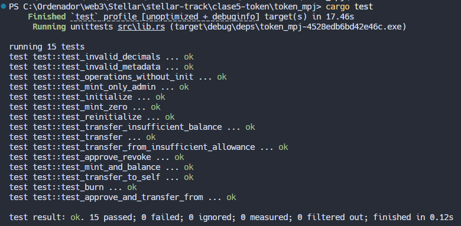
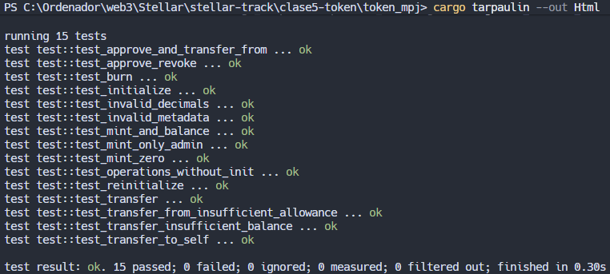

# Token MiPasaje – Guía Completa del Proyecto 🚍

## Historia de MiPasaje

**El Problema:** En las microempresas de transporte de pasajeros no existe un sistema confiable para controlar los pasajes vendidos y utilizados. Los registros son manuales, poco claros o inexistentes, lo que genera: 
- ❌ Pasajeros que se cuelan
- ❌ Falta de control sobre cobradores y unidades, ningún historial verificable de viajes, los pasajes son pagos invisibles: se cobran, pero no dejan evidencia real.
- ❌ Ningún historial verificable de viajes
- ❌ Los pasajes son pagos invisibles: se cobran, pero no dejan evidencia real.

**La Solución:** MiPasaje es un token en Stellar donde **1 MPJ = 1 viaje válido**. Cada pasaje vendido se registra como un token en blockchain, creando un sistema digital, transparente e inalterable que garantiza que todo pasajero que sube, paga, y que todo pago queda registrado.

## Visión del Proyecto

MiPasaje es un sistema de registro descentralizado para microempresas de transporte, construido sobre Stellar blockchain, que permite:

- 🎟️ Emitir pasajes digitales verificables
- 🚫 Evitar que pasajeros se cuelen
- 📊 Llevar control real de ingresos y afluencia
- 🚌 Registrar viajes por ruta, unidad y horario
- 🔍 Auditoría transparente para dueños y autoridades

## Flujo del Sistema
```bash
initialize: admin (configura contrato)
   ↓
mint (recarga): admin (vende pasajes)
   ↓
balance (consulta): user (verifica pasajes)
   ↓
approve (autorizar): user (permite gastar pasajes)
   ↓
transfer_from (pagar pasaje): user2 (gasta pasajes autorizados)
   ↓
burn (validar uso) : admin (elimina pasajes usados)
```

## Arquitectura del Proyecto
```bash
token_bdb/
├── src/
│   ├── lib.rs       # Contract principal
│   ├── storage.rs   # Tipos de almacenamiento
│   ├── errors.rs    # Manejo de errores
│   └── test.rs      # Tests unitarios
├── Cargo.toml       # Configuración optimizada
└── img/
    ├── test-running.png
    ├── compilacion-exitosa.png
    ├── out-html.png
    ├── reporte.png
    └── AliceTransaccionesEjemplo.jpg
```

### Pasos para contruir y ejecutar el proyecto
1. **Clonar el Repositorio**
   ```bash
   git clone https://github.com/Alsnj20/stellar-track.git
   ```
2. **Navegar al Directorio del Proyecto**
   ```bash
   cd clase5-token/token_mpj
   ```
3. **Verificar y Ejecutar Compilacion y Testing**
   ```bash
   cargo check
   cargo test
   ```
3. **Compilar el Proyecto**
   ```bash
   stellar contract build
   ```
4. **Optimizar WASM**
   ```bash
   stellar contract optimize --wasm <path>
   ```
5. **Deployar a Testnet**
   ```bash
   stellar contract deploy --wasm <path> --network testnet
   ```

## Funcionalidades Clave
- **initialize:** Configura el contrato con parámetros iniciales.
- **mint:** Permite al administrador emitir nuevos tokens (pasajes).
- **balance:** Consulta el saldo de tokens de un usuario.
- **approve:** Autoriza a otro usuario a gastar tokens en su nombre.
- **transfer_from:** Permite a un usuario gastar tokens autorizados.
- **burn:** Elimina tokens usados, validando su uso.

## Capturas de Pantalla

## Resultados de Testing


## Compilación Optima


## Reporte HTML de Tests

## Reporte de Cobertura


