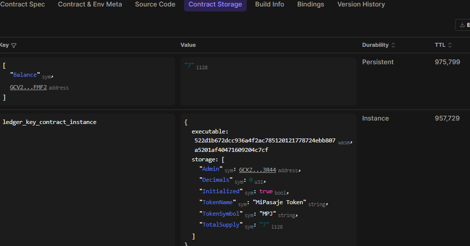

# Ejemplo de Uso del Token MiPasaje
## Credenciales
- **Administrador (admin)**
  - Public Key: `GCKZXWCJVI7333MK67VIQIKTXZVD7ENZ6RIUZ33Z4364UE37IXBA3R44`
- **Usuario Alice (alice)**
  - Public Key: `GCV2D7AFQOQADNIXYKQ75ONQ3AVAJ7UYBFSJMQOOY7YUR3CWZY3NFMF2`
- **Usuario Conductor (bob)**
  - Public Key: 
  `GB6JKCMZG7A5IEPPCRJYANKKBUK6W2DMKK7HQSS46WOH6YFGVFUOLR5L`

`Importante:` Estas claves son solo para fines de prueba en la red de testnet de Stellar. Si decides crear tu cuenta con la stellar cli, no olvides fundearla.

## Escenario de Uso
Para interactuar con el contrato simulando un flujo real, usaremos la CLI de `stellar`.

### 1. Inicializar el Token
Supongamos que el administrador inicializa el token "MiPasaje" (MPJ) sin decimales.

```bash
stellar contract invoke \
  --id CDE25CO3EYOJFPBWAP7OZV5WCUTM66QDDVYT7KV72DKCDQR4NWMRTIDA \
  --source-account admin \
  --network testnet \
  -- initialize \
  --admin admin \
  --decimals 0 \
  --name "MiPasaje Token" \
  --symbol "MPJ"
```
Salida esperada: 
```bash
Signing transaction: 10c7971742c4f00874243199ede59fcab8598839ccf33464d010fc74114901e0
null
```

### 2. Recargar saldo a Alice (Mint)
Alice compra 10 pasajes. El admin le emite 10 MPJ.
*(Recordar: 0 decimales → 10 pasajes = 10 unidades)*

```bash
stellar contract invoke \
  --id CDE25CO3EYOJFPBWAP7OZV5WCUTM66QDDVYT7KV72DKCDQR4NWMRTIDA \
  --source-account admin \
  --network testnet \
  -- mint \
  --to alice \
  --amount 10
```

### 3. Alice consulta su saldo
Alice verifica que recibió sus pasajes.

```bash
stellar contract invoke \
  --id CDE25CO3EYOJFPBWAP7OZV5WCUTM66QDDVYT7KV72DKCDQR4NWMRTIDA \
  --source-account alice \
  --network testnet \
  -- balance \
  --account alice
```
**Salida esperada:** `10`

### 4. Alice paga un viaje (Transfer)
Alice se sube al transporte y paga 1 pasaje (1 MPJ) al conductor `bob`.

```bash
stellar contract invoke \
  --id CDE25CO3EYOJFPBWAP7OZV5WCUTM66QDDVYT7KV72DKCDQR4NWMRTIDA \
  --source-account alice \
  --network testnet \
  -- transfer \
  --from alice \
  --to bob \
  --amount 1
```

### 5. Verificar saldos finales
- **Alice:** 9 MPJ (`90000000`)
- **Bob:** 1 MPJ (`10000000`)

### 6. Flujo Alternativo: Pago con Autorización
Si se desea que el conductor se cobre el pasaje (ej. al pasar una tarjeta):

**Paso A: Alice autoriza al conductor**
Alice permite que `bob` gaste hasta 5 MPJ de su cuenta.
```bash
stellar contract invoke \
  --id CDE25CO3EYOJFPBWAP7OZV5WCUTM66QDDVYT7KV72DKCDQR4NWMRTIDA \
  --source-account alice \
  --network testnet \
  -- approve \
  --from alice \
  --spender bob \
  --amount 5
```

**Paso B: El conductor cobra**
El conductor ejecuta el cobro de 2 MPJ.
```bash
stellar contract invoke \
  --id CDE25CO3EYOJFPBWAP7OZV5WCUTM66QDDVYT7KV72DKCDQR4NWMRTIDA \
  --source-account bob \
  --network testnet \
  -- transfer_from \
  --spender bob \
  --from alice \
  --to bob \
  --amount 2
```

### 7. Verificar saldos finales
- **Alice:** 7 MPJ (`7`)
- **Bob:** 2 + 1 MPJ (`3`)

### 8. Quemar Pasajes Usados
El conductor quema los pasajes que ya fueron usados (3 MPJ).
```bash
stellar contract invoke \
  --id CDE25CO3EYOJFPBWAP7OZV5WCUTM66QDDVYT7KV72DKCDQR4NWMRTIDA \
  --source-account bob \
  --network testnet \
  -- burn \
  --from bob \
  --amount 3
```

**Verificar saldo final de Bob:** 0 MPJ (`0`)

## Captura y Resultados
### Saldo Final de Todos
- **Admin:** 0 MPJ
- **Alice:** 7 MPJ
- **Bob:** 0 MPJ

`DUDA:` Porque el admin tiene 0 MPJ si emitió 10 al inicio? El admin no es un usuario común, es como una regla, se encarga de verficar.
### Captura del Storage
